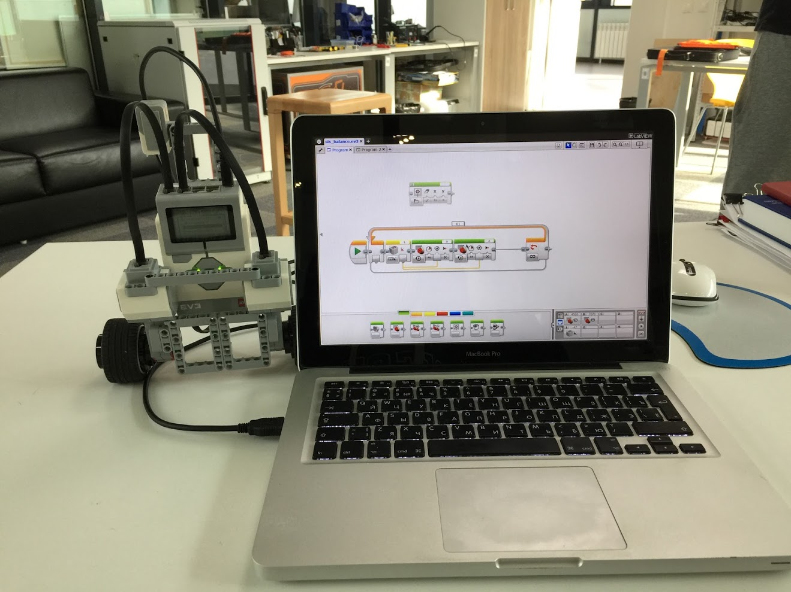

# inverted pendulum
### Made by Misha Bortnikov in 2017
### Lego Mindstorms EV3 inverted pendulum implementation

This project represents implementation of classical control theory task — be able to control unstable dynamical system with center of mass above its pivot point.
It is a home task #4 of System Identifiaction and Symulation course. See video with detailed explanation.

### Work process
It is possible to program Lego Mindstorms robots using a few instruments:
- LEGO MINDSTORMS EV3 Home Edition
- LEGO C IDE
- Special Python Package
- Matlab

It was interesting for me to implement this task in way close to that intended by the manufacturer, so I choosed **LEGO MINDSTORMS EV3 Home Edition**.

##### Building robot
Before build this robot I had searched the net and found that this task is already solved on LEGO robots, but there is no concise way to do it. Moreover, constructions of this robot is different for each project and usualy contains not used components. So I build my own minimalistic structure.

##### PID controller impelmentation
At first glance it seems impossible to implement PID controller in this graphical blocks user interface. Thanks to this [video](https://www.youtube.com/watch?v=AMBWV_HGYj4) it is not so hard task if you know PID theory.
Also is better not to use simple green colored motor controllers. PID control works better with blue colored advanced motor controllers from program.
Tuning of this controllers was implemeted by hands. I get the following coefficients:
- Kp = 3
- Ki = 0.1
- Kd = 0.3

Actually, system works even without Differential part, but Integrator is vital.

##### Gyroscope
LEGO contain only one-axis gyro. It is enough to build this pendulum task, but restricts from doing more interesting things.
The main problem for the gyro is its drifting of zero. It is well known [problem](https://bricks.stackexchange.com/questions/7115/how-can-ev3-gyro-sensor-drift-be-handled).
To overcome it I used only "rate" mode. It gives deriviation of angle form gyro. Unfortunately, this method still have significant drifting, so in best attempts this robot could stand only half a minute.
How to oevercome it completely? The best solution is to make outer feedback loop for the system by speed of wheels.

##### Video with work of robot
See the last minute of this video to see how it works https://youtu.be/axrLSOYgsuM?t=6m44s

